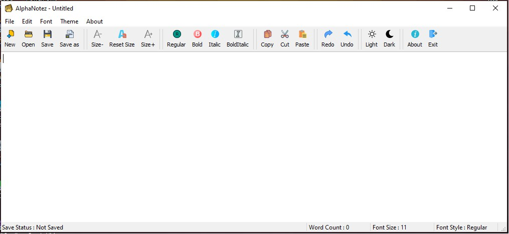
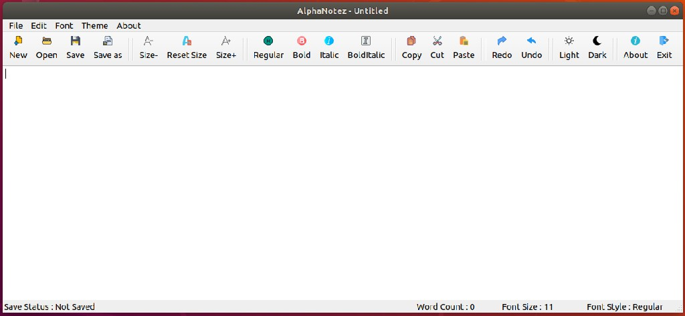

# Cross-Platform Notepad Application - AlphaNotez

A simple text editor (notepad) application using C++ with Qt framework called AlphaNotez. It supports multiple platforms. This application can use to create, edit or view text files. Also, this application provides basic essential functionalities. The user interface is very simple and easy to use.

## Screenshots

